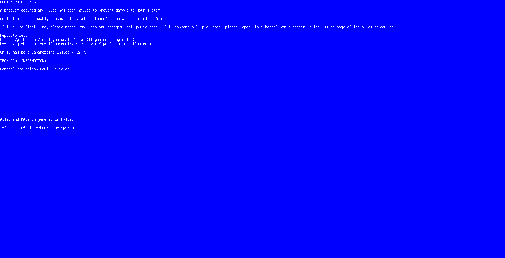
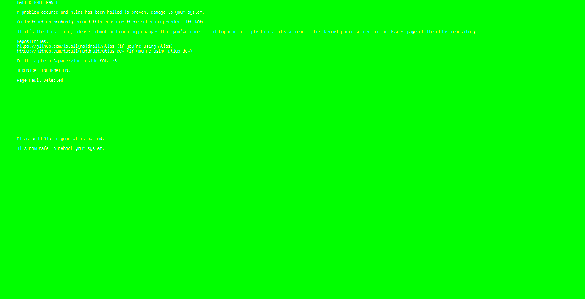

# Panic Screens

- <i><b>Blue Screen:</b></i> It's a normal panic screen that indicates Atlas has crashed because of a irreversible error

- <i><b>Green Screen:</b></i> It's the same as the Blue Screen, but the background is green and the text is not placed correctly, which it shouldn't happen. This rarely happens if it was a mistake on writting the interrupts, and so causes this screen.

